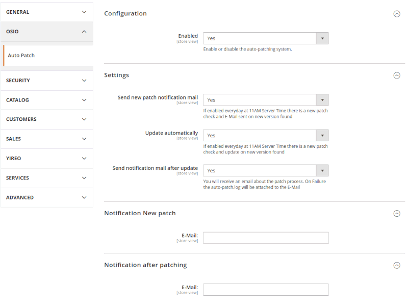

# Magento Auto Patch

## Overview

The **Patch AutoUpdater** module for Magento 2 automates the process of checking and applying **minor patches (example: 2.4.6 - 2.4.6-p2)**. It integrates directly with Magento’s patch management system, reducing the need for manual intervention, ensuring your store remains secure and up-to-date.

## Features
- **Automated Patch Lookup**: Automatically checks for the latest Magento patches.
- **Notifies you** before and after the update
- **Patch Application**: Applies patches directly via CLI or automated cron jobs.
- **Custom CLI Command**: Use `bin/magento patch:update` to manually check and apply patches.
- **Logging**: log errors `auto-patch.log`. This get sent on failure with the after patch notification
- **Restricted Usage** for Users in Admin Group ony

**If something goes wrong or you don't want to patch yourself. Send me a mail: oaliu@hotmail.com**

## Installation

### Install the Module
    composer require aliuosio/magento-autopatch
    bin/magento setup:upgrade

### Enable the Module (automates check for new patch and install)
    stores -> configuration -> Osio -> Auto Patcher -> enable

### Patch the System (manually check for new patch and install)
    bin/magento patch:update

## Minor Requirements
Before using the module, ensure your system meets the following requirements:
1. **PHP**: Version 7.4 or higher.
2. **Composer**: Version 2.1.6 or higher.
3. **Magento**: Version 2.4.0 or higher.

### Disclaimer

This module, **Osio_MagentoAutoPatch**, is designed to assist with applying Magento patches automatically. **It is intended for use on test or staging servers only.** Before applying any patches or updates to a live production environment, you should thoroughly test them in a non-production environment to ensure compatibility and stability.

I, the author, **Osiozekhai Aliu**, **take no responsibility** for any issues, downtime, or broken functionality that may arise from using this module on production servers. It is strongly recommended that all patches are tested in a controlled environment before being applied to a production server.
By using this module, you acknowledge that you are solely responsible for any outcomes resulting from its use.

#### Todos
* ~~add command implementation: Feedback loop for processes~~
* ~~add tested on magento versions to README~~
* ~~refactor process class usage~~
* ~~add deploy modes handling~~
* ~~add error handling in extra module log~~
* ~~add separate log file~~
* ~~Add backend Dialog and command implementation: Enable switch~~
* ~~fix Error setting Production Mode when not in production mode~~
* ~~add comments under fields in system.xml~~
* ~~add disclaimer to README~~
* ~~change composer usage~~
* ~~add minor requirements~~
* ~~Add backend Dialog and command implementation: notification per mail of available patch~~
* ~~Add backend Dialog and command implementation: Patch automatically or not (comment cron has to bee set up to use)~~
* ~~Add backend Dialog and command implementation: notification per mail of after auto-patch~~
* add auto-patch.log as Attachment to after patch mail
* Add ACL
